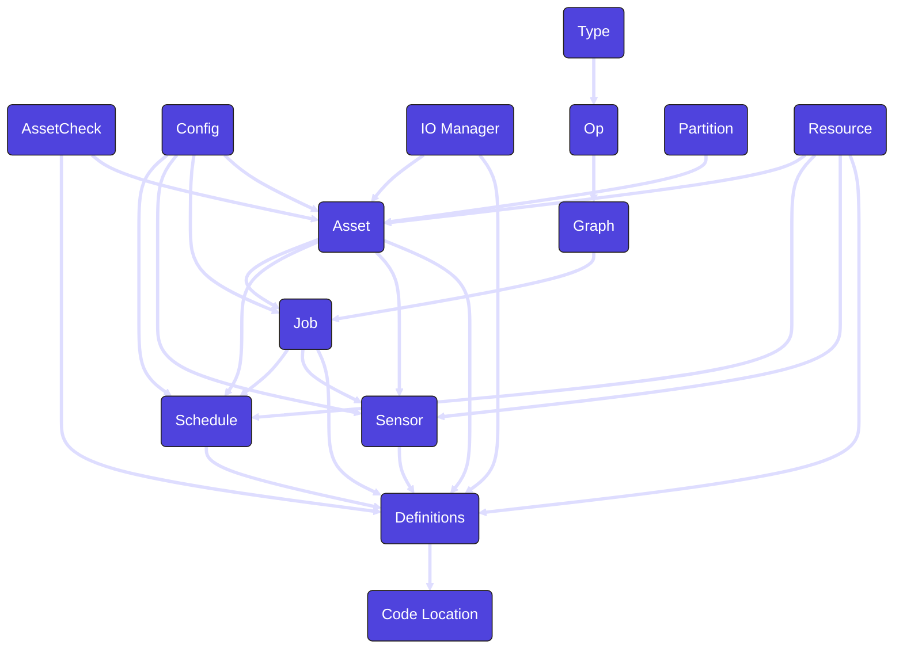

Dagster は、データ パイプラインの構築とオーケストレーションのためのさまざまな抽象化を提供します。これらの概念により、データ エンジニアリングに対するモジュール式の宣言型アプローチが可能になり、依存関係の管理、実行の監視、データ品質の確保が容易になります。

### アセット

 <PyObject section="assets" module="dagster" object="asset" /> は、テーブル、データセット、機械学習モデルなどのデータの論理単位を表します。アセットは他のアセットに依存し、パイプラインのデータ系統を形成することができます。アセットは Dagster のコア抽象化として、他の多くの Dagster 概念と相互作用して、特定のタスクを容易にすることができます。

| Concept | Relationship |
| --- | --- |
| [asset check](concepts#asset-check) | `asset` may use an `asset check` |
| [config](concepts#config) | `asset` may use a `config` |
| [io manager](concepts#io-manager) | `asset` may use a `io manager` |
| [partition](concepts#partition) | `asset` may use a `partition` |
| [resource](concepts#resource) | `asset` may use a `resource` |
| [job](concepts#job) | `asset` may be used in a `job` |
| [schedule](concepts#schedule) | `asset` may be used in a `schedule` |
| [sensor](concepts#sensor) | `asset` may be used in a `sensor` |
| [definitions](concepts#definitions) | `asset` must be set in a `definitions` to be deployed |

### Asset Check

<PyObject section="asset-checks" module="dagster" object="asset_check" />  は、データの品質、鮮度、完全性に関する特定の期待を満たすように <PyObject section="assets" module="dagster" object="asset" /> に関連付けられます。アセット チェックは、アセットが実行されたときに実行され、関連する実行に関するメタデータと、チェックのすべての条件が満たされたかどうかを保存します。

| Concept | Relationship |
| --- | --- |
| [asset](concepts#asset) | `asset check` は `asset` によって使用される可能性があります |
| [definitions](concepts#definitions) | デプロイするには、`asset check` を `definitions` に設定する必要があります。 |

### Code Location

`code location` は、特定の環境にデプロイされた <PyObject section="definitions" module="dagster" object="Definitions" /> のコレクションです。コードの場所は、Python 環境 (使用されている Dagster のバージョンやその他の Python 依存関係を含む) を決定します。Dagster プロジェクトには複数のコードの場所を設定できるため、依存関係を分離するのに役立ちます。

| Concept | Relationship |
| --- | --- |
| [definitions](concepts#definitions) | `code location` には少なくとも 1 つの `definitions` が含まれている必要があります |

### Config

<PyObject section="config" module="dagster" object="RunConfig" /> は、実行時に入力される Dagster オブジェクトに適用されるセット スキーマです。これにより、パラメーター化とパイプラインの再利用が可能になり、複数の目的に使用できます。

| Concept | Relationship |
| --- | --- |
| [asset](concepts#asset) | `config` は `asset` によって使用される場合があります |
| [job](concepts#job) | `config` は `job` によって使用される場合があります |
| [schedule](concepts#schedule) | `config` は `schedule` によって使用される場合があります |
| [sensor](concepts#sensor) | `config` は `sensor` によって使用される場合があります |

### Definitions

<PyObject section="definitions" module="dagster" object="Definitions" /> は、<PyObject section="assets" module="dagster" object="asset" pluralize />、<PyObject section="jobs" module="dagster" object="job" pluralize />、<PyObject section="schedules-sensors" module="dagster" object="ScheduleDefinition" pluralize /> など、Dagster プロジェクトのすべてのオブジェクトへの参照を含むトップレベル構造です。定義に含まれるオブジェクトのみがデプロイされ、Dagster UI 内に表示されます。

| Concept | Relationship |
| --- | --- |
| [asset](concepts#asset) | `definitions` には 1 つ以上の `assets` が含まれる場合があります |
| [asset check](concepts#asset-check) | `definitions` には 1 つ以上の `asset checks` が含まれる場合があります |
| [io manager](concepts#io-manager) | `definitions` には 1 つ以上の `io manager` が含まれる場合があります。 |
| [job](concepts#job) | `definitions` には 1 つ以上の `jobs` が含まれる場合があります |
| [resource](concepts#resource) | `definitions` には 1 つ以上の `resources` が含まれる場合があります |
| [schedule](concepts#schedule) | `definitions` には 1 つ以上の `schedules` が含まれる場合があります |
| [sensor](concepts#sensor) | `definitions` には 1 つ以上の `sensors` が含まれる場合があります |
| [code location](concepts#code-location) | `definitions` は `code location` にデプロイする必要があります |

### Graph

<PyObject section="graphs" module="dagster" object="GraphDefinition" method="to_job" /> は複数の <PyObject section="ops" module="dagster" object="op" pluralize /> を接続して DAG を形成します。<PyObject section="assets" module="dagster" object="asset" pluralize /> を使用している場合は、グラフを直接使用する必要はありません。

| Concept | Relationship |
| --- | --- |
| [config](concepts#config) | `graph` は `config` を使用する場合があります |
| [op](concepts#op) | `graph` には 1 つ以上の `ops` が含まれている必要があります |
| [job](concepts#job) | 実行するには `graph` は `job` の一部でなければなりません |

### IO Manager

<PyObject section="io-managers" module="dagster" object="IOManager" /> は、<PyObject section="assets" module="dagster" object="asset" pluralize /> と <PyObject section="ops" module="dagster" object="op" pluralize />　の実行間でデータがどのように保存および取得されるかを定義します。これにより、パイプライン内のあらゆるインタラクションでカスタマイズ可能なストレージとフォーマットが可能になります。

| Concept | Relationship |
| --- | --- |
| [asset](concepts#asset) | `io manager` は `asset` によって使用される場合があります |
| [definitions](concepts#definitions) | デプロイするには、`io manager` を `definitions` に設定する必要があります。 |

### Job

<PyObject section="jobs" module="dagster" object="job" /> は <PyObject section="assets" module="dagster" object="asset" pluralize /> のサブセットまたは <PyObject section="ops" module="dagster" object="op" pluralize /> の <PyObject section="graphs" module="dagster" object="GraphDefinition" method="to_job" /> です。ジョブは Dagster における実行の主な形式です。

| Concept | Relationship |
| --- | --- |
| [asset](concepts#asset) | `job` には `assets` の選択が含まれる場合があります |
| [config](concepts#config) | `job` は `config` を使用する場合があります |
| [graph](concepts#graph) | `job` には `graph` が含まれる場合があります |
| [schedule](concepts#schedule) | `job` は `schedule` によって使用される場合があります |
| [sensor](concepts#sensor) | `job` は `sensor` によって使用される場合があります |
| [definitions](concepts#definitions) | `job` はデプロイするために `definitions` 内に設定する必要があります |

### Op

<PyObject section="ops" module="dagster" object="op" /> は、作業の計算単位です。Op は <PyObject section="graphs" module="dagster" object="GraphDefinition" method="to_job" /> に配置され、順序が決定されます。Op は主に <PyObject section="assets" module="dagster" object="asset" pluralize /> に置き換えられました。

| Concept | Relationship |
| --- | --- |
| [type](concepts#type) | `op` は `type` を使用する場合があります |
| [graph](concepts#graph) | 実行するには `op` が `graph` に含まれている必要があります |

### Partition

<PyObject section="partitions" object="PartitionsDefinition" /> は、特定のセグメント (時間の増分など) にマップされたデータセットまたは計算の論理スライスを表します。パーティションにより増分処理が可能になり、関連するデータのサブセットのみを実行することでワークフローの効率が向上します。

| Concept | Relationship |
| --- | --- |
| [asset](concepts#asset) | `partition` は `asset` によって使用される場合があります |

### Resource

<PyObject section="resources" module="dagster" object="ConfigurableResource"/> は、構成可能な外部依存関係です。これらには、データベース、API、または Dagster 外部のあらゆるものが含まれます。

| Concept | Relationship |
| --- | --- |
| [asset](concepts#asset) | `resource` は、`asset` によって使用される可能性があります|
| [schedule](concepts#schedule) | `resource` は `schedule` によって使用される可能性があります |
| [sensor](concepts#sensor) | `resource` は `sensor` によって使用される可能性があります |
| [definitions](concepts#definitions) | デプロイするには、`resource` を `definitions` に設定する必要があります。 |

### Type

`type` は <PyObject section="ops" module="dagster" object="op" pluralize /> 間で渡されるデータを定義および検証する方法です。

| Concept | Relationship |
| --- | --- |
| [op](concepts#op) | `type` は `op` によって使用される場合があります |

### Schedule

<PyObject section="schedules-sensors" module="dagster" object="ScheduleDefinition" />  は、指定された間隔で <PyObject section="jobs" module="dagster" object="job" pluralize /> または <PyObject section="assets" module="dagster" object="asset" pluralize /> を自動的に実行する方法の 1 つです。ジョブまたはアセットがパラメーター化されている場合は、一致するように実行構成  (<PyObject section="config" module="dagster" object="RunConfig" />) を使用してスケジュールを設定することもできます。

| Concept | Relationship |
| --- | --- |
| [asset](concepts#asset) | `schedule` には `job` または `assets` の選択が含まれる場合があります |
| [config](concepts#config) | `job` または `assets` に `config` が含まれている場合、`schedule` に `config` が含まれることがあります。 |
| [job](concepts#job) | `schedule` には `job` または `assets` の選択が含まれる場合があります |
| [definitions](concepts#definitions) | デプロイするには、`schedule` を `definitions` に設定する必要があります。 |

### Sensor

`sensor` は、ファイルのアップロードやプッシュ通知などのイベントが発生したときに <PyObject section="jobs" module="dagster" object="job" pluralize /> または <PyObject section="assets" module="dagster" object="asset" pluralize /> をトリガーする方法です。ジョブまたはアセットがパラメーター化されている場合は、一致するように実行構成 (<PyObject section="config" module="dagster" object="RunConfig" />) を使用してセンサーを設定することもできます。

| Concept | Relationship |
| --- | --- |
| [asset](concepts#asset) | `sensor` には `job` または `assets` の選択が含まれる場合があります |
| [config](concepts#config) | `job` または `assets` に `config` が含まれている場合、`sensor` に `config` が含まれることがあります。 |
| [job](concepts#job) | `sensor` には `job` または `assets` の選択が含まれる場合があります |
| [definitions](concepts#definitions) | `sensor` は、デプロイするには `definitions` で設定する必要があります |
