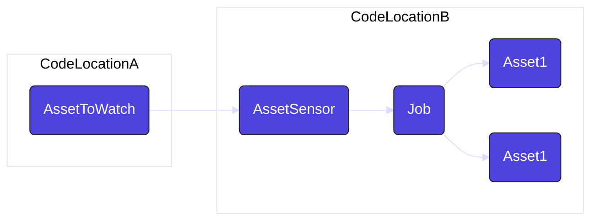
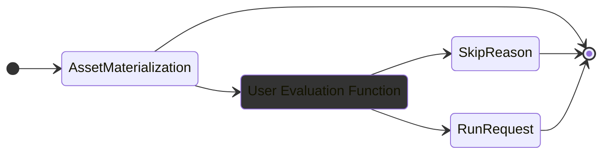

Dagster のアセットセンサーは、アセットの実現を監視し、それらのイベントに基づいて下流の計算や通知をトリガーするための強力なメカニズムを提供します。

このガイドでは、ジョブ間およびコード間の場所の依存関係の定義など、資産センサーの最も一般的な使用例について説明します。

:::note

このドキュメントは、[アセット](/guides/build/assets/) と [ジョブ](/guides/build/assets/asset-jobs) に精通していることを前提としています。

:::

## はじめる

アセット センサーは、アセットの新しいマテリアライゼーション イベントを監視し、新しいマテリアライゼーションが発生したときにジョブをターゲットにします。

通常、アセット センサーは、新しいジョブがトリガーされるときに `RunRequest` を返します。ただし、アセットの具体化によってジョブがトリガーされない場合は、`SkipReason` が提供される場合があります。

たとえば、毎日生成されるアセットを監視したいが、休日にはジョブをトリガーしたくない場合があります。

## ジョブ間およびコード間の場所の依存関係

アセットセンサーにより、さまざまなジョブやさまざまなコードの場所間での依存関係が可能になります。この柔軟性により、モジュール化された分離されたワークフローが可能になります。

これは、アセットがマテリアライズされたときにジョブをトリガーするアセットセンサーの例です。この例では、`daily_sales_data` アセットはジョブや他のアセットと同じコードの場所にありますが、同じパターンを異なるコードの場所にあるアセットに適用できます。

<CodeExample path="docs_beta_snippets/docs_beta_snippets/guides/automation/simple-asset-sensor-example.py" language="python" />

## センサーの評価関数のカスタマイズ

アセットセンサーの評価関数をカスタマイズして、実行をトリガーするタイミングを決定するための特定のロジックを含めることができます。これにより、下流のジョブが実行される条件をきめ細かく制御できます。

次の例では、`@asset_sensor` デコレータは、アセットが具体化され、特定のメタデータが存在する場合に `RunRequest` オブジェクトを返し、それ以外の場合は実行をスキップするカスタム評価関数を定義します。

<CodeExample path="docs_beta_snippets/docs_beta_snippets/guides/automation/asset-sensor-custom-eval.py" language="python"/>

## カスタム構成でジョブをトリガーする

`RunRequest` オブジェクトに設定を指定すると、特定の設定でジョブをトリガーできます。これは、定義したカスタム ロジックに基づいてカスタム パラメータでジョブをトリガーする場合に便利です。

たとえば、アセットがマテリアライズされたときにセンサーを使用してジョブをトリガーし、そのマテリアライズに関するメタデータをジョブに渡すこともできます:

<CodeExample path="docs_beta_snippets/docs_beta_snippets/guides/automation/asset-sensor-with-config.py" language="python" />

## 複数アセットの監視

:::note

`@multi_asset_sensor` は非推奨としてマークされていますが、Dagster 2.0 がリリースされるまでコードベースから削除されません。つまり、当面は現在と同じように機能し続けます。その機能は、`AutomationCondition` システムによって大部分が置き換えられました。詳細については、[宣言型オートメーションのドキュメント](/guides/automate/declarative-automation/)を参照してください。

:::

パイプラインを構築するときに、1 つのセンサーで複数のアセットを監視したい場合があります。これは、マルチアセット センサーで実現できます。

次の例では、`@multi_asset_sensor` を使用して 2 つのアセットを監視し、両方が実現されるとアセット ジョブをトリガーします。この方法で op ジョブをトリガーすることもできます。

<CodeExample path="docs_beta_snippets/docs_beta_snippets/guides/automation/multi-asset-sensor.py" language="python" />

## 次は

- アセットセンサーの代替として[宣言型自動化](/guides/automate/declarative-automation/)を検討する