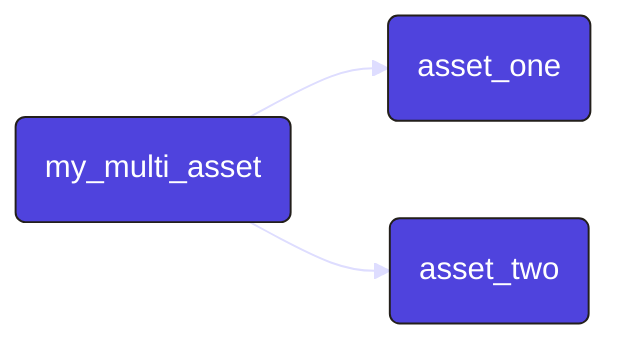
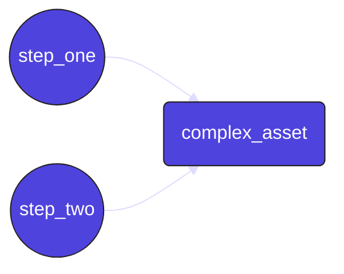

Dagster でデータ アセットを作成する最も一般的な方法は、Python 関数に <PyObject section="assets" module="dagster" object="asset" decorator /> デコレータを注釈として付けることです。この関数は、データベース テーブルやファイルなどのアセットの内容を計算します。

アセットの定義には、次のものが含まれます:

* アセットを参照するためのハンドルである `AssetKey`。
* アセット定義の内容の派生元となるアセットを参照する、アップストリームのアセットのキーのセット。
* 上流の依存関係からアセットの内容を計算し、結果を保存する役割を担う Python 関数。

<details>
  <summary>前提条件</summary>

この記事のコードを実行するには、Dagster をインストールする必要があります。詳細については、[インストールガイド](/getting-started/installation) を参照してください。

</details>

## アセットデコレータ

Dagsterには4種類のアセットデコレータがある:

| Decorator            | Description                                                          |
| -------------------- | -------------------------------------------------------------------- |
| `@asset`             | 単一のアセットを定義します。[例を参照](#single-asset)。                 |
| `@multi_asset`       | 1 回の操作で複数のアセットを出力します。[例を参照](#multi-asset)。       |
| `@graph_asset`       | 各操作自体をアセットにせずに、複数の操作から単一のアセットを出力します。[例を参照](#graph-asset)。 |
| `@graph_multi_asset` | 複数の操作から複数の資産を出力する                                      |

## 単一のアセットを作成する操作の定義 \{#single-asset}

Dagster でデータ アセットを定義する最も簡単な方法は、<PyObject section="assets" module="dagster" object="asset" decorator /> デコレータを使用することです。このデコレータは、Python 関数をアセットとしてマークします。

<CodeExample path="docs_snippets/docs_snippets/guides/data-assets/data-assets/asset_decorator.py" language="python" title="Using @dg.asset decorator" />


この例では、`weekly_sales_report` は出力をログに記録するアセットです。Dagster は依存関係を自動的に追跡し、パイプライン内で実行を処理します。

## 複数のアセットを作成する操作の定義 \{#multi-asset}

1 回の操作で複数のアセットを生成する必要がある場合は、<PyObject section="assets" module="dagster" object="multi_asset" decorator /> デコレータを使用できます。これにより、単一の処理関数を維持しながら複数のアセットを出力できるため、次のような場合に役立ちます:

- 複数のテーブルを更新する API を 1 回呼び出す
- 同じメモリ内オブジェクトを使用して複数のアセットを計算する

この例では、`my_multi_asset` は `asset_one` と `asset_two` の 2 つのアセットを生成します。それぞれは同じ関数から派生しているため、関連するデータ変換をまとめて処理しやすくなります。

<CodeExample path="docs_snippets/docs_snippets/guides/data-assets/data-assets/multi_asset_decorator.py" language="python" title="Using @dg.multi_asset decorator" />

この例は次のように表現できます:



## 単一のアセットを作成する複数の操作を定義する \{#graph-asset}

複数の操作を実行して単一のアセットを生成する必要がある場合は、<PyObject section="assets" module="dagster" object="graph_asset" decorator /> デコレータを使用できます。このアプローチでは、一連の操作をカプセル化して単一のアセットとして公開するため、最終出力のみを公開しながら複雑なパイプラインをモデル化できます。

<CodeExample path="docs_snippets/docs_snippets/guides/data-assets/data-assets/graph_asset_decorator.py" language="python" title="Using @dg.graph_asset decorator" />

この例では、`complex_asset` は `step_one` と `step_two` の 2 つの操作の結果であるアセットです。これらのステップは 1 つのアセットに結合され、中間表現が抽象化されます。

この例は次のように表現できます:



## Asset context

アセットを定義するときに、オプションで最初のパラメータ `context` を指定できます。このパラメータを指定すると、Dagster は <PyObject section="execution" module="dagster" object="AssetExecutionContext" /> オブジェクトをアセットの本体に提供し、ロガーや現在の実行 ID などのシステム情報へのアクセスを提供します。

たとえば、ロガーにアクセスして情報メッセージを記録するには、次のようにします:

```python
from dagster import AssetExecutionContext, asset


@asset
def context_asset(context: AssetExecutionContext):
    context.log.info(f"My run ID is {context.run.run_id}")
    ...

```

## Asset code versions

アセットには `code_version` が割り当てられる場合があります。バージョンを使用すると、コードが変更されてから再マテリアライズされていないアセットを Dagster が追跡し、冗長な計算の実行を回避できます。

```python

@asset(code_version="1")
def asset_with_version():
    with open("data/asset_with_version.json", "w") as f:
        json.dump(100, f)

```

コード バージョンを持つアセットがマテリアライズされると、生成された `AssetMaterialization` にバージョンがタグ付けされます。アセットのコード バージョンが、最新のマテリアライズに使用されたコード バージョンと異なる場合、UI にそのことが示されます。

## マルチパートキーを持つアセット

アセットは、多くの場合、ファイルシステムのような階層的な名前空間を持つシステム内のオブジェクトです。このため、アセット キーは、単一の文字列ではなく、文字列のリストであることが理にかなっています。複数の部分から成るアセット キーを持つアセットを定義するには、文字列のリストを指定した `key_prefix` 引数を使用します。完全なアセット キーは、アセット名 (デフォルトでは、装飾された関数の名前) の前に `key_prefix` を追加することで形成されます。

<CodeExample path="docs_snippets/docs_snippets/concepts/assets/multi_component_asset_key.py" startAfter="start_marker" endBefore="end_marker" />

## 次は

- Dagster の組み込みデータカタログを [アセットメタデータ](/guides/build/assets/metadata-and-tags/)で強化します。
- [アセット間でデータを渡す](/guides/build/assets/passing-data-between-assets)方法を学ぶ
- [ファクトリーパターン](/guides/build/assets/creating-asset-factories)を使用して、複数の類似したアセットを作成する方法を学びます。
